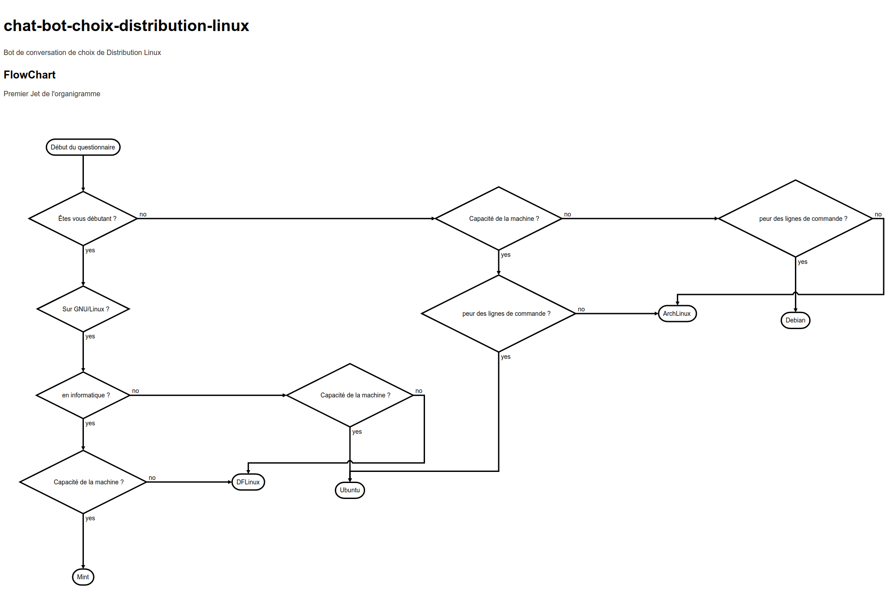
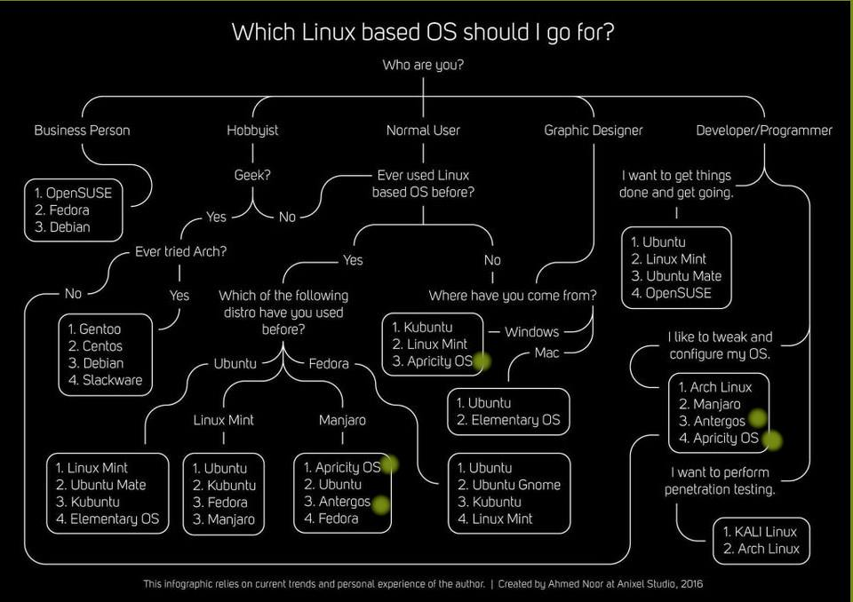

# chat-bot-choix-distribution-linux
Bot de conversation de choix de Distribution Linux

##Tableau :
tableau question https://lite.framacalc.org/9hup-yjh64atols
tableau liste distribution : https://lite.framacalc.org/9hup-pkflf0yt0x

##Lien YouTube (R) Présentation distributions !

https://www.youtube.com/watch?v=6w2jBj8m7-8&t=3393s

##Concurrent :

https://distrochooser.de/?l=2

###FlowChart

Premier Jet du diagramme  

``` flow
st=>start: Début du questionnaire
cond1=>condition: Êtes vous débutant ?
cond2=>condition: Sur GNU/Linux ?
cond3=>condition: Capacité de la machine ?
cond4=>condition: en informatique ?
cond6=>condition: Capacité de la machine ?
cond7=>condition: Capacité de la machine ?
cond8=>condition: peur des lignes de commande ?
cond9=>condition: peur des lignes de commande ?
U=>end: Ubuntu
M=>end: LinuxMint
D=>end: DFLinux
A=>end: ArchLinux
B=>end: Debian

st->cond1
cond1(yes)->cond2
cond1(no)->cond3
cond2(yes)->cond4
cond4(yes)->cond7
cond4(no)->cond6
cond6(yes)->U
cond6(no)->D
cond7(yes)->M
cond7(no)->D
cond3(yes)->cond8
cond3(no)->cond9
cond8(yes)->U
cond8(no)->A
cond9(yes)->B
cond9(no)->A
```



